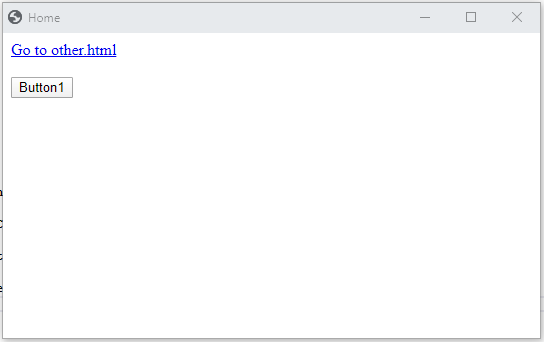
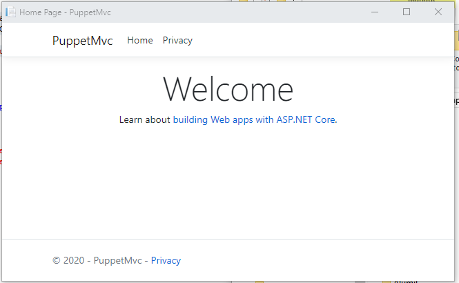
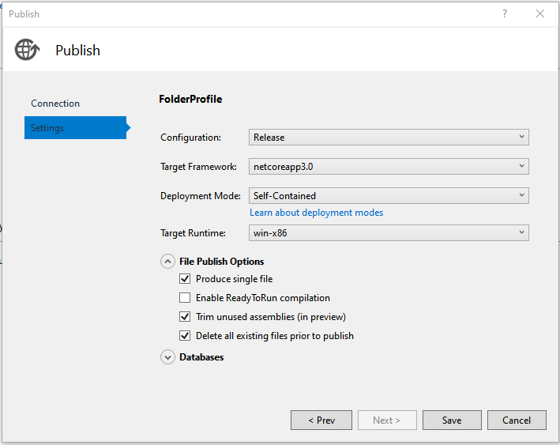
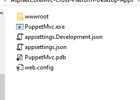

# Cross-platform Desktop applications using AspNet Core or plain static HTML files.   

A way to develop cross-platform Desktop GUI applications using C# and [Chrome](https://en.wikipedia.org/wiki/Google_Chrome) as a very light alternative to [Electron](https://en.wikipedia.org/wiki/Electron_(software_framework)) and [Electron.NET](https://github.com/ElectronNET/Electron.NET) libraries.

**Source code** can be found at [github](https://github.com/tbebekis/AspNetCoreMvc-Cross-Platform-Desktop-Apps)

## Introduction
This project uses an existing [Chrome](https://en.wikipedia.org/wiki/Google_Chrome) installation to present an AspNet Core application or a plain HTML application comprised of static files (html, javascript and css), as a Desktop application. 

No [Chromium](https://en.wikipedia.org/wiki/Chromium_(web_browser)) or [NodeJS](https://en.wikipedia.org/wiki/Node.js) is needed nor [Chromium Embedded Framework (CEF)](https://en.wikipedia.org/wiki/Chromium_Embedded_Framework) or [CefSharp](https://github.com/cefsharp/CefSharp).

## Background
The idea is old: why not use html, javascript and css in building desktop applications that can be executed by a browser and thus be cross-platform? 

There are many answers to this question. A few of them are following:

- [Electron](https://en.wikipedia.org/wiki/Electron_(software_framework))
- [Electron.NET](https://github.com/ElectronNET/Electron.NET)
- [Chromely](https://github.com/chromelyapps/Chromely)
- [Ooui](https://github.com/praeclarum/Ooui)
- [Apache Cordova](https://en.wikipedia.org/wiki/Apache_Cordova) (mobile)
- [Ionic](https://en.wikipedia.org/wiki/Ionic_(mobile_app_framework)) (mobile)
- [SpiderEye](https://github.com/JBildstein/SpiderEye)
- [Steve Sanderson's WebWindow](https://blog.stevensanderson.com/2019/11/18/2019-11-18-webwindow-a-cross-platform-webview-for-dotnet-core/)
- [WebView](https://github.com/zserge/webview)
- [WebView-cs](https://github.com/webview-cs/webview-cs)
- [Google's Carlo](https://github.com/GoogleChromeLabs/carlo)
- [CarloSharp](https://github.com/gkmo/CarloSharp)
- [Positron](https://github.com/CenterEdge/Positron)

## Description of this solution
This solution is based on the idea that Google's Chrome browser is installed on a very high percent of machines running either MS Windows or Linux or MacOS. At the same time .Net Core and AspNet Core run on all of those OSes.

What is needed is a way to first create an instance of the Chrome browser and then instruct it to navigate to a "Home" url.

There is already a way to do the above with [NodeJS](https://en.wikipedia.org/wiki/Node.js): the [Mathias Bynens's](https://github.com/mathiasbynens) excellent [Puppeteer](https://github.com/puppeteer/puppeteer) NodeJS library. Google provides a [portal](https://developers.google.com/web/tools/puppeteer) about Puppeteer, full of valuable information and examples.

And then there is a C# port of the [Puppeteer](https://github.com/puppeteer/puppeteer), the [Puppeteer-Sharp](https://github.com/kblok/puppeteer-sharp) by [Darío Kondratiuk](https://github.com/kblok). Many thanks to Darío.

Here is the description of Puppeteer from github.
> Puppeteer is a Node library which provides a high-level API to control Chrome or Chromium over the [DevTools Protocol](https://chromedevtools.github.io/devtools-protocol/). Puppeteer runs **headless** by default, but can be configured to run full (non-headless) Chrome or Chromium.

This solution is not based on a [Headless Chrome browser](https://en.wikipedia.org/wiki/Headless_browser). Instead it uses a normal Chrome window with a single tab page and no address bar at all. The Puppeteer and of course the Puppeteer-Sharp can run the Chrome browser in such a way.

## A C# class to control the Chrome browser

This project contains a static class named [Chrome](https://github.com/tbebekis/AspNetCoreMvc-Cross-Platform-Desktop-Apps/blob/master/PuppetConsole/Chrome.cs) with less than 400 lines of code, which is used in launching Chrome and navigating to the first HTML page. For that, the Chrome class provides the `Launch()` method

```
static public void Launch(ChromeStartOptions Options, Action Closed = null)
```
which accepts an Options object and a call-back to call when the browser closes. Here is the `ChromeStartOptions` class.

```
    public class ChromeStartOptions
    {
        public ChromeStartOptions(bool IsAspNetCoreApp = true)
        {
            this.IsAspNetCoreApp = IsAspNetCoreApp;
        }

        public bool IsAspNetCoreApp { get; set; } = true;
        public string ChromePath { get; set; } = "";
        public string HomeUrl { get; set; } = @"Index.html";
        public string ContentFolder { get; set; } = "wwwroot";
        public int Left { get; set; } = 300;
        public int Top { get; set; } = 150;
        public int Width { get; set; } = 1024;
        public int Height { get; set; } = 768;
    }
```

The `HomeUrl` and `ContentFolder` properties are used with a static HTML application, not with an AspNet Core application.

## Use Chrome with a .Net Core Console application (static Web Application)

Here is how to use it in a .Net Core Console application in order to present a plain HTML application as a Desktop application.

```
static void Main(string[] args)
{
    ManualResetEvent CloseEvent = new ManualResetEvent(false);            
    Chrome.Launch(new ChromeStartOptions(false), () => {
        CloseEvent.Set();
    });            
    CloseEvent.WaitOne();
}
```

## Use Chrome with an AspNet Core MVC application
And here is how to call it from inside the `Configure()` method of a `Startup` AspNet Core class in order to present an AspNet Core MVC application as a Desktop application.

```
public void Configure(IApplicationBuilder app, IWebHostEnvironment env)
{
    // code here ....
    
    
    // call Chrome as the last thing in the Configure method
    Chrome.Launch(new ChromeStartOptions(true), () => {
        IHostApplicationLifetime LifeTime = app.ApplicationServices.GetService(typeof(IHostApplicationLifetime)) as IHostApplicationLifetime;
        LifeTime.StopApplication();
    });
}
```

## The Launch() method of the Chrome class.
The flag passed to the `Launch()` method, through the `ChromeStartOptions` instance, indicates the type of the application. True means AspNet Core, while false means a plain static HTML application.

The caller may pass more information to the `Launch()` method through the instance of the  `ChromeStartOptions` class. The `ChromePath` is such a bit of information, denoting the path where Chrome can be found. 

Right now the `Crome` class does its best in order to find where Chrome browser is installed on Windows and Linux. I plan to study the code of the [Chrome Launcher](https://github.com/GoogleChrome/chrome-launcher) project and try to deal better with this problem. 

The `Chrome.Launch()` method calls the `Chrome.LaunchAsync()` method which does the following:
- processes the passed in options
- prepares a Puppeteer-Sharp's `LaunchOptions` instance. 
- calls the `Puppeteer.LaunchAsync(options)` method and gets back a `Browser` instance. 
- if this is an AspNet Core application then that options instance is prepared and already contains the initial Url. Else this step is postponed for a later time. 
- now Chrome is already up and running, showing a single tab `Page`.
- the code gets a reference to that `Page`.
- if this is **not** an AspNet Core application, links an event handler to that `Page` in order to fulfill incoming requests, since there is no web server. And right after that calls `Page.GoToAsync(url)` passing the "Home" Url of the application.
- in the next step, and in both cases, links another event handler to the `Page` in order to handle the closing of the browser.

Here is the full code of the `Chrome.LaunchAsync()` method.

```
static public async Task LaunchAsync(ChromeStartOptions Options, Action Closed = null)
{
    if (Browser == null)
    {
        // prepare options
        IsAspNetCoreApp = Options.IsAspNetCoreApp;

        if (!string.IsNullOrWhiteSpace(Options.ContentFolder))
        {
            ContentFolder = Path.GetFullPath(Options.ContentFolder);
        } 

        HomeUrl = !IsAspNetCoreApp ? $@"http://{SStaticApp}/{Options.HomeUrl}" : $"http://localhost:{Port}"; 

        List<string> ArgList = new List<string>(DefaultArgs);

        string AppValue = !IsAspNetCoreApp ? "data:text/html, loading..." : Chrome.HomeUrl;

        ArgList.Add($"--app={AppValue}");   // The --app= argument opens Chrome in app mode that is no fullscreen, no url bar, just the window
        ArgList.Add($"--window-size={Options.Width},{Options.Height}");
        ArgList.Add($"--window-position={Options.Left},{Options.Top}");

        LaunchOptions LaunchOptions = new LaunchOptions
        {
            Devtools = false,
            Headless = false,
            Args = ArgList.ToArray(),
            ExecutablePath = !string.IsNullOrWhiteSpace(Options.ChromePath) ? Options.ChromePath : FindChromPath(),
            DefaultViewport = null
        };

        // launch Chrome
        Browser = await Puppeteer.LaunchAsync(LaunchOptions);

        // get the main tab page
        Page[] Pages = await Browser.PagesAsync().ConfigureAwait(false);
        TabPage = Pages[0];

        // event handler for static files
        if (!IsAspNetCoreApp)
        {
            await TabPage.SetRequestInterceptionAsync(true);
            TabPage.Request += StaticRequestHandler;
            await TabPage.GoToAsync(Chrome.HomeUrl, WaitUntilNavigation.DOMContentLoaded);
        }

        // event handler for close
        TabPage.Close += (sender, ea) => {
            Closed?.Invoke();
            Closed = null;
            TabPage = null;
            if (!Browser.IsClosed)
                Browser.CloseAsync();
            Browser = null;
        };

    }
}
```
## The "plain" HTML demo application

The easy case. It is a .Net Core 3.0 console application.

The `Output Type` is set to `Windows Application` just to hide the console box when running.

The application happens to contain a folder named `wwwroot` which is the default value of the `ContentFolder` property of the `ChromeStartOptions` class.

```
public string ContentFolder { get; set; } = "wwwroot";
```
The `ContentFolder` property indicates the root content folder where static files (html, js, css) are placed.

The `wwwroot` folder contains an `Index.html` file which again happens to be the default value of the `HomeUrl` property of the `ChromeStartOptions` class.

```
public string HomeUrl { get; set; } = @"Index.html";
```

Here is the application running.



## The AspNet Core demo application.

The tough case. It is an AspNet Core 3.0 MVC application without any more code than the template of the Visual Studio 2019 preview produces.

There are some things to do in order to make this application to work properly.

The first `PropertyGroup` of the project file should be like the following.

```
    <PropertyGroup>
        <TargetFramework>netcoreapp3.0</TargetFramework>
        <AspNetCoreHostingModel>OutOfProcess</AspNetCoreHostingModel>
        <ApplicationIcon />
        <OutputType>WinExe</OutputType>
        <StartupObject />
    </PropertyGroup>
```

The above makes the application an [Out of Process](https://docs.microsoft.com/en-us/aspnet/core/host-and-deploy/aspnet-core-module) one and hides the console while is running.

The `lauchSettings.json` file, found in `Properties` folder, follows.

```
{
    "profiles": {
        "PuppetMvc": {
            "commandName": "Project",
            "environmentVariables": {
                "ASPNETCORE_ENVIRONMENT": "Development"
            },
            "applicationUrl": "http://localhost:5000"
        }
    }
}
```

That's all the file content. Just a single profile and no settings regarding IIS Express at all. The `5000` port is not actually used by the application. The `Chrome` class finds and uses the first free port.

The `Program` class should be as following.

```
public class Program
{

    public static void Main(string[] args)
    {
        CreateHostBuilder(args).Build().Run();
    } 

    public static IHostBuilder CreateHostBuilder(string[] args) =>
        Host.CreateDefaultBuilder(args)
            .ConfigureWebHostDefaults(webBuilder =>
            {                    
                webBuilder.ConfigureKestrel(o =>
                {
                    o.Listen(IPAddress.Loopback, Chrome.Port);  
                })
                .UseStartup<Startup>();
            });

}
```

The only difference from the template code is that it configures [Kestrel](https://docs.microsoft.com/en-us/aspnet/core/fundamentals/servers/kestrel) to listen to the selected port.

Here is the application running.





### Publish the AspNet Core demo application 

Here is the publish settings.





The above creates a [Self-Contained](https://docs.microsoft.com/en-us/dotnet/core/deploying/) deployment, in a single file, after "trimming" any unused assemblies.

Here is the content of the `Publish` folder. The *.exe is 43 MB large and contains everything, AspNet Core included. Only the static files are in the `wwwroot` folder.





And the best of all: double-clicking the *.exe runs the application inside the Chrome browser.

## Conclusion

Thanks to Chrome and the Puppeteer-Sharp there is another one possibility, among the others, in creating cross-platform Desktop applications built with web technologies. This one does not need Chromium or NodeJS or anything else. The only thing it needs to know is where is Chrome installed.


